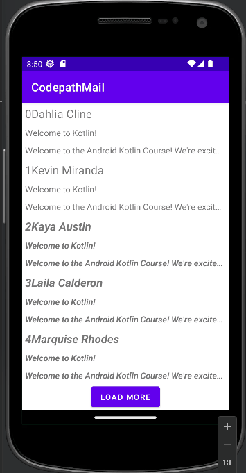

# CodePath_Android_inclass_Lab

### Table of Content
* Week 1: [Tap_Counter_App](#tap-counter-app)
* Week 2: [CodepathMail](#codepathmail)

## Tap Counter App

  
Walkthrough

  
  

 

## CodepathMail

  
Walkthrough

  
  

 

