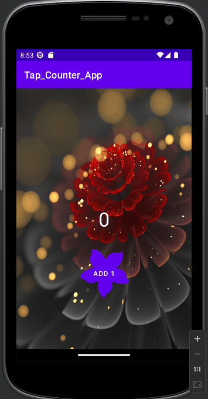

# CodePath_Android_inclass_Lab

### Table of Content
* Week 1: [Tap_Counter_App](#tap-counter-app)
* Week 2: [CodepathMail](#codepathmail)
* Week 3: [CodePath_NY_Times_Bestselling_Books](#codepath-ny-times-bestselling-books)

## Tap Counter App
* [Source code](https://github.com/QuanHNguyen232/CodePath_Android_InClass_Lab/tree/main/Tap_Counter_App)
* 

  
Walkthrough

  
 

## CodepathMail
* [Source code](https://github.com/QuanHNguyen232/CodePath_Android_InClass_Lab/tree/main/CodepathMail)
* 

  
Walkthrough

  
 

## CodePath NY Times Bestselling Books
* [Source code](https://github.com/QuanHNguyen232/CodePath_Android_InClass_Lab/tree/main/CodePath_NY_Times_Bestselling_Books) (using starter code from CodePath: [and102-lab3-starter](https://github.com/codepath/and102-lab3-starter))
* 

  
Walkthrough

  
 

